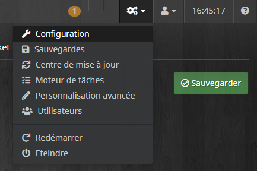

API
===
Le plugin RPICT met à disposition une api afin de mettre à jour les données depuis d'autres systèmes.
Il s'agit d'une URL d'appel de type GET.
Pour y accéder ces informations sont obligatoires :

URL = http://#IP_JEEDOM#:#PORT_JEEDOM#/jeedom/plugins/rpict/core/php/jeeRpict.php?api=#VOTRE_API_JEEDOM#&nid=#NODE_ID_RPICT#

 #IP_JEEDOM# correspond à l'adresse ip de votre Jeedom
 #PORT_JEEDOM# correspond au port d'accès à votre Jeedom
 #VOTRE_API_JEEDOM# est la clé API disponible depuis le menu Général / Administration / Configuration

 

 #NODE_ID_RPICT# correspond au NodeID de la carte RPICT. Cette information est obligatoirement transmise par la carte RPICT lorsque vous recevez une trame.

Attention le /jeedom peux être différent si vous êtes sur une installation DIY ou OEM. En règle générale il faut l'ajouter.

A cette url d'appel vous pouvez ajouter les différentes valeurs suivant le format : &#NOM_DE_LA_VALEUR#=#VALEUR#

Par exemple pour le channel 1 équivalent à 123456789 :

*&ch1=123456789*

L'URL sera donc surchargée de toutes information utile.

Par exemple :

    IP_JEEDOM : 192.168.1.15
    PORT_JEEDOM : 80
    VOTRE_API_JEEDOM : zertyuiolkjhgfdsxc
    NODE_ID_RPICT : 11
    Channel1 : 123456789

Donnera l'URL : http://192.168.1.15:80/jeedom/plugins/rpict/core/php/jeeRpict.php?api=zertyuiolkjhgfdsxc&nid=11*&ch1=123456789*
