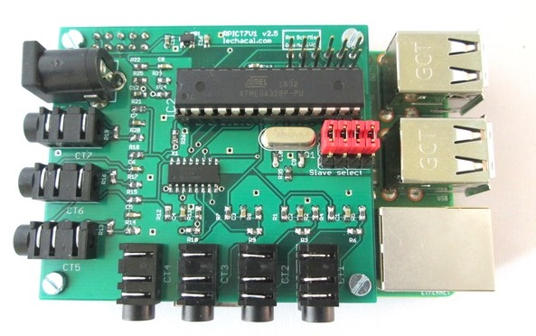
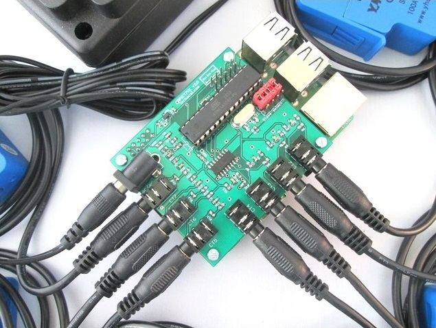
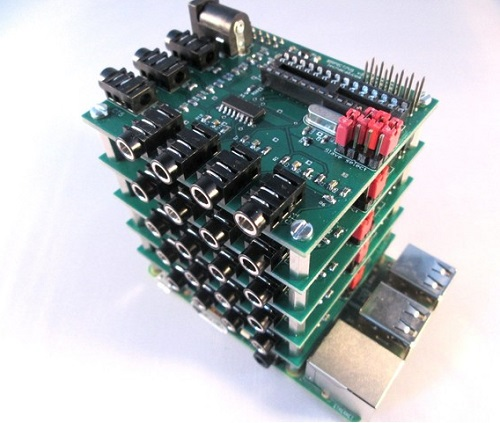
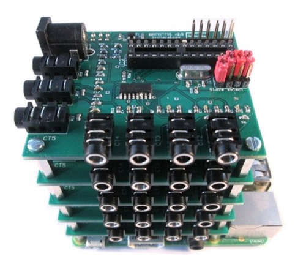

Architecture
===
Pour récupérer les informations de votre carte RPICT series, il faut tout d'abord la connecter à votre Raspberry PI :

## RPICT series

Voir documentation complète ici
[Raspberrypi Current and Temperature Sensor Adaptor](http://lechacal.com/wiki/index.php?title=Raspberrypi_Current_and_Temperature_Sensor_Adaptor)

## RPICT7V1_v2.0

### Compatibilité

| Version          | Compatible? |
| ---------------- | ----------- | 
| Raspberrypi 1 A  | Non |
| Raspberrypi 1 B+ | Oui |
| Raspberrypi 2 B  | Oui |
| Raspberrypi 3 B  | Oui |
| Raspberrypi 3 B+ | Oui |
| Raspberrypi 4 B  | Oui |

### Senseurs recommandés

* AC Current sensor:
     * SCT-013-000
     * SCT-019
     * SCT-006
* AC Voltage sensor:
     * UK: 77DB-06-09
     * EU: 77DE-06-09
     * US: 77DA-10-09

VOLTAGE OUTPUT CT NE SONT PAS COMPATIBLES AVEC CETTE CARTE.

Cas d'utilisation de plsuieurs cartes RPICT
===

## Empilement des cartes RPICT en HAT sur la Raspberry PI
Les cartes RPICT7V1 version2 peuvent être empilées avec d'autres cartes RPICT7V1 ou RPICT4V3 ou RPICT8 afin d'étendre le nombre de senseurs supportés.
Attention, sur le site du constructeur, toutes les unités vendus sont préconfigurés en tant que MASTER.
Se référer au wiki du constructeur pour voir comment les configurer en tant qu'Esclave.
[Stacking Documentation](http://lechacal.com/wiki/index.php/RPICT_Stacking)

