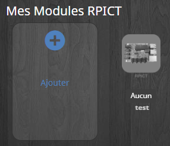
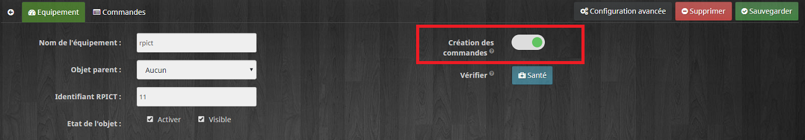

Configuration
===

Le plugin offre la possibilité de créer automatiquement les commandes réceptionnées. Pour cela démarrez le daemon, attendez que les premières trames arrivent puis rendez vous sur Plugin / Protocoles Domotiques / RPICTV7.

Vous devez créer l'objet, lui donner un nom et vous arrivez dans la page de configuration de la carte RPICT.

Il faut saisir le node ID de la carte RPICT (préprogrammées à la valeur 11 en sortie d'usine).
Sélectionnez "Création automatique des commandes" en haut à droite, enfin sauvegardez. 

A partir de ce moment toutes les commandes reçu et non reconnu seront ajoutée automatiquement.

Vous pouvez également créer les commandes manuellement :
-   Créez votre nouvel appareil en cliquant sur Ajouter
-   Ajoutez les commandes que vous souhaitez récupérer en cliquant sur le bouton vert "Commande"
-   Renseignez le nom affiché dans Jeedom, le Sous-Type en fonction de l'information qui sera récupérée, le channel concerné de la carte et enfin les paramètres associés.
-   Cliquez sur sauvegarder.
