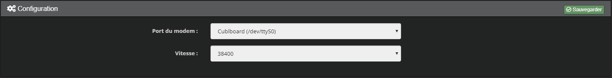

Installation
===

## Configuration de la carte RPICT sur votre Raspberry

Votre Raspberry dialogue avec la carte RPICT via le port série.
Il faut donc configurer le Rapsberry pour ce port série fonctionne.

Voir documentation complète du constructeur [ICI](http://lechacal.com/wiki/index.php?title=Howto_setup_Raspbian_for_serial_read)

### Activer le port série

* Run the raspi-config tool,

    ```$ sudo raspi-config```

* Then disable the login uart :

    ```5 Interfacing Options / P6 Serial```

    * Select No to the login shell question.
    * Select Yes to the serial port hardware to be enabled question.
    * Select Ok at the summary.

* Back at the menu select finish.
    * Select No to the reboot question (we will do that later).

### Configuration générale Raspberry

* Editer le fichier /boot/config.txt

    ```$ sudo nano /boot/config.txt```

* A la fin du fichier, rajouter

    ```dtoverlay=pi3-disable-bt```

* Désactiver hciuart

    ```sudo systemctl disable hciuart```

        (!) OPTIONNEL, Les deux commandes ci dessous désactive le bluetooth de la RPI. Si le BT est utilisé, ne pas exécuter cette étape et utiliser ttyS0 au lieu de ttyAMA0 dans les étapes suivantes.

* Redémarrer la Raspberry Pi

    ```sudo reboot```

### Test du bon fonctionnement

Une fois la carte RPICT insérée et la raspberry redémarrée, un test peut etre fait en ligne de commandes pour vérifier que tout est OK.
Il faut configurer le port et lancer une écoute.

```stty -F /dev/ttyAMA0 raw speed 38400```

```cat /dev/ttyAMA0```


## Installation du Plugin Jeedom

### Installation

Installer le plugin depuis le market en suivant les instructions : https://jeedom.github.io/core/fr_FR/plugin

### Configuration

Après avoir activé le plugin vous devez choisir le port du modem :



Suivant si vous avez laissé  le BlueTooth ou pas (voir ci dessus), le port à utiliser peut etre parmis les deux suivants :
* /dev/ttyS0
* /dev/ttyAMA0

Enfin pensez à sauvegarder.

Un nouveau Protocole est disponible dans Plugins => Protocole domotique => RPICT7V1
