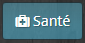
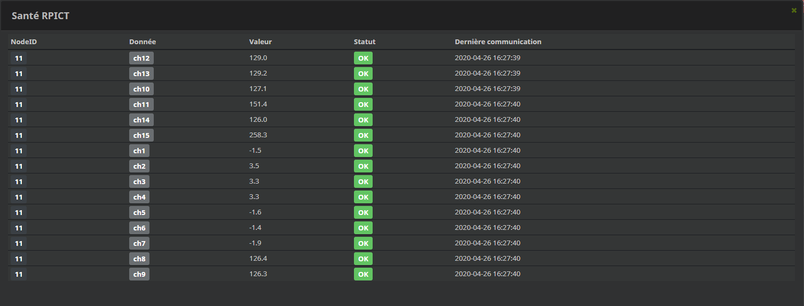

Santé
===
Il est possible de vérifier la réception des données avant traitement.

Pour cela rendez vous sur l'objet RPICT puis cliquez sur Santé

La fenêtre qui s'ouvre permet de vérifier la bonne reception des données par NodeID pour chaque channel :

